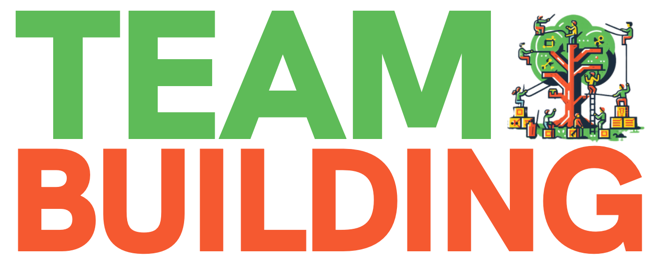

**

This repo contains the code for the Summer Camp Nava22's team-building game. Most of the text is Italian, but the code is English.

### Goal
Each participant starts alone and finds out their team at the end of the game. The team is built up progressively, beginning with a single player, then forming a pair, quartets, etc. In phase 1, two singles join to create a couple; in phase 2, two pairs join to form a quartet and so on. The team is the union of three octets.

### Phases
The game is divided into four phases. The first is a distributed 'guess who?'. Player A has to look for player B and, by winning games, receives clues about him (e.g. age, hair colour, favourite sport, favourite food, etc.). Each stand gives a hint from a predefined category (e.g. favourite food), and the game is themed on the type of clue.
The second and fourth phases are treasure hunts, mostly offline (the first with clues and the second with geographical coordinates). The third phase is similar to the first, but instead of being between individuals, the search is between foursomes.

### Architecture
To progress through the various stages, participants play stands. The stands use this repo (as a streamlit dashboard) to go through the game. For example, through the dashboard, the stands work out which clues to give the player in the first phase. The dashboard also contains management data to manage better the game (e.g. load balancing of players).

### Code
Python, MongoDB, Streamlit, various PDF libraries and plotly were used for this project.